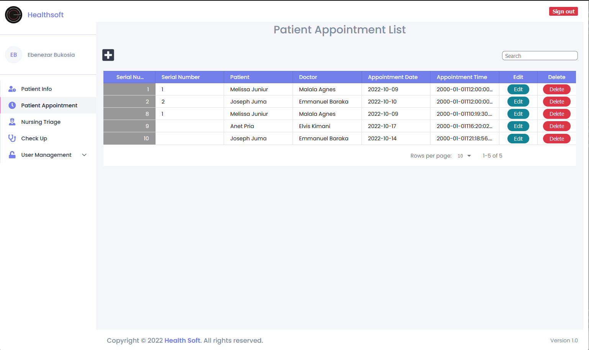

# Health soft

---

### Author : BUKOSIA EBENEZAR

---

## Project Description

Health soft is a hospital management system module ment to manage patient admintion, patient appointments and patients treatment.

---

<!-- ## Demo

####  -->

## SCREENSHOTS

### Login page

#### 

### Patients info

#### 

### Patient addmition

#### 

### Patient vitals

#### 

### Vitals recording

#### 

### Appointments

#### 

### Appointment booking

#### 

### Check up

#### 

### Doctors checkup

#### 

### Doctors

#### 

### Nurses

#### 

### Add new Doctor

#### 

## Table of content

- [Technologies](#description)
- [Description](#description)
- [Features](#features)
- [Setup-process](#setup_process)
- [Project-usage](#project-usage)
- [Licence](#licence)
- [Copyright](#copyright)

---

## Technologies

languages used are:

- Front-end

1. React(Typescript)
2. Sass

---

- Back-end

1. Ruby on Rails

---

### Features

- As a Nurse you can be able to:

1. Login with his/her account.
2. Register a new patient
3. Manage registered patients( update info, delete records)
4. take patients vitals signs
5. Book appointment(s) for a patient

- As a Doctor you can be able to:

1. View all the appointments.
2. Check up patients records
3. Do a checkup on a patient and record your findings and diagnosis

- AS an admin you can be able to:

4. Add new nurse, doctor or admin
5. Update system users details.
6. Delete an system users account

---

### description

- When a patient walks in the hospital he is admited if it is the first time he/she visits
- His or her vitals signs will be recorded, including, temperature blood presure...
- The nurse at reception will book an appointment for the patient with available doctor
- The doctor will recieve the patient, and check on recorded vitals signs
- the doctor will diagonise the patient and record the finding

---

### challenges

- Saving a profife picture for system users.

---

## How to set up and run the project

### Requirements

- [npm](https://www.npmjs.com/)
- Text editor eg [Visual Studio Code](https://code.visualstudio.com/download)

---

### Dependencies

- npm
- ruby
- rails
- node

---

### setup

#### Client (React)

clone the repo using the command

```shell
git clone git@github.com:Ebenezr/health-soft.git
```

change directory using command

```shell
cd health-soft
```

open project in vscode texteditor

```shell
code .
```

install dependancies

```shell
npm install
```

run front end

```shell
npm run dev
```

---

#### API (Ruby on Rails)

clone the repo using the command

```shell
git clone git@github.com:Ebenezr/health-soft-api.git
```

change directory using command

```shell
cd health-soft-api
```

open project in vscode texteditor

```shell
code .
```

Check your Ruby version

```shell
ruby -v
```

The ouput should start with something like `ruby 2.5.1`

If not, install the right ruby version using [rbenv](https://github.com/rbenv/rbenv) (it could take a while):

```shell
rbenv install 2.7.0
```

install dependancies packages

```shell
bundle install
```

Initialize the database

```shell
rails db:create db:migrate db:seed
```

run api server

```shell
rails s
```

---

#### live link

- run the following live link in your browser
  `https://health-soft.vercel.app`

#### login Auths..

admin:

```shell
email: admin@admin.com
password: admin@admin.com
```

nurse:

```shell
email: leah@gmail.com
password: leah1990
```

doctor

```shell
emai: emmanuel@gmail.com
password: emmanuel
```

## How to use the project

---

### Contributing to project

- Fork the repo

* Create a new branch in your terminal (git checkout -b improve-feature)
* Install the prerequisites
* Make appropriate changes in file(s)
* Run the server to see the changes
* Add the changes and commit them (git commit -am "Improve App")
* Push to the branch (git push origin improve-app)
* Create a Pull request

---

## Copyright

Copyright(c)[2022][bukosia ebenezar]

---

## Contact Information

- Email : ebenezarbukosia@gmail.om

---

## [License](LICENSE)

MIT License
Copyright (c) 2022 Bukosia Ebenezar
